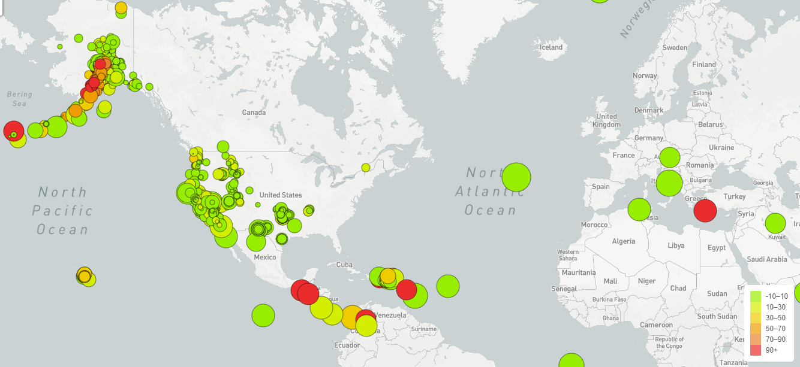
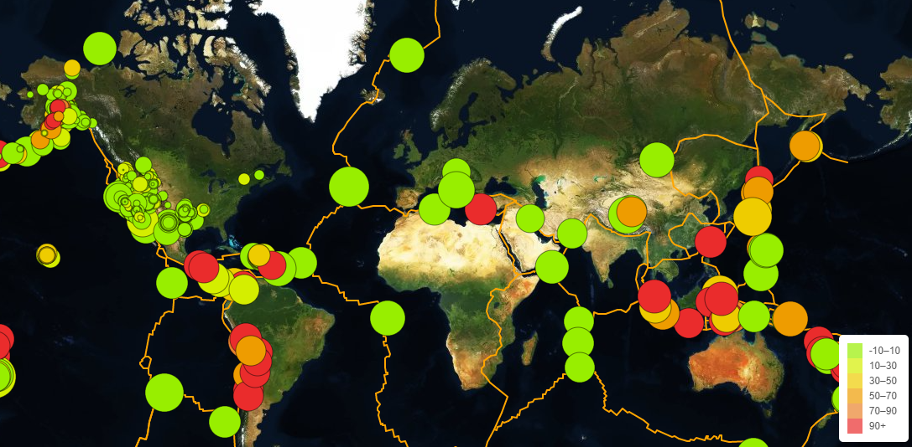

# Leaflet Challenge - Visualizing Earthquake Data

## Background

The United States Geological Survey, or USGS, is responsible for providing scientific data about natural hazards, the health of our ecosystems and environment; and the impacts of climate and land-use change. Their scientists develop new methods and tools to supply timely, relevant, and useful information about the Earth and its processes.

### Level 1: Basic Visualization 

Visualizing data set of all earthquakes in the last 7 days.

1. **Get data set**

   The USGS provides earthquake data in a number of different formats, updated every 5 minutes. [USGS GeoJSON Feed](http://earthquake.usgs.gov/earthquakes/feed/v1.0/geojson.php) 
   For this project, we used the 'All Earthquakes from the Past 7 Days' JSON data.

2. **Import & Visualize the Data**

   Created a map using Leaflet that plots all of the earthquakes from the data set based on their longitude and latitude.

   * Data markers reflect the magnitude of the earthquake by their size and and depth of the earth quake by color. Earthquakes with higher magnitudes appear larger and earthquakes with greater depth appear darker in color.

   * Popups provide additional information about the earthquake when a marker is clicked.

   * The legend provides context for the map data.

- - -

### Level 2: More Data

This map illustrates the relationship between tectonic plates and seismic activity. Data on tectonic plates was found at <https://github.com/fraxen/tectonicplates>.

In this step we:

* Plotted a second data set on our map.

* Added a number of base maps to choose from as well as separate out our two different data sets into overlays that can be turned on and off independently.

* Added layer controls to our map.

- - -
